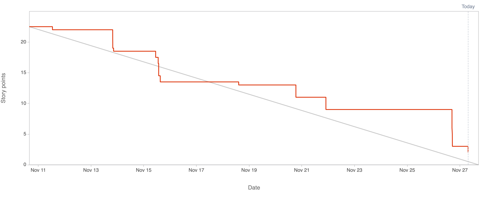

# 2.6.3 Sprint Review

## Review Sprint Ziele

| **Sprint Ziel**                             | **Status** |
| ------------------------------------------- | ---------- |
| Project Start                               | 100%       |
| Define exchange format 2 integrate into AWS | 80%        |
| Projectmanagement Documentation             | 100%       |
| Deside Camuda Version                       | 100%       |
| Start designing Business Process            | 100%       |

## Status Project Board

| **Total Tickets** | **Abgeschlossene Tickets** | **Nicht abgeschlossene Tickets** | **Prozentsatz** |
| :---------------: | -------------------------- | -------------------------------- | --------------- |
|        24         | 23                         | 1                                | 95.8333         |

| **Total Storypoints** | **Abgeschlossene Storypoints** | **Nicht abgeschlossene Storypoints** | **Prozentsatz** |
| :-------------------: | ------------------------------ | ------------------------------------ | --------------- |
|         22.5          | 20.5                           | 2                                    | 91.1111         |

## Anpassungen am Projekt?

Es werden keine Anpassungen am Projekt vorgenommen.

## Notizen / Anmerkungen

Der Start der Semesterarbeit gelang ohne grosse Hürden. Es wurden sehr viele administrative Arbeiten erledigt, welche leider sehr viel Zeit beansprucht haben. Für das Projekt sind sie jedoch notwendig. Ich denke, es sinnvoll ist diese Arbeiten zu Beginn durchzuführen, damit keine Konflikte entstehen.

Bezüglich des einen offenen Tickets mache ich mir keine grosse Sorgen. Es wurde zwar bereits abgeschlossen, jedoch steht die Dokumentation noch aus. Dabei handelt es sich um das Besprechungsprotokoll für das Data Exchange Meeting.

---

- [GIT Repository Tag - Sprint01](https://github.com/Cloud-native-engineering/sem02_bpm/releases/tag/sprint-01)
- [Jira Board](https://itcne23.atlassian.net/jira/software/projects/BPM/boards/2)
- [Jira Sprint Tickets](https://itcne23.atlassian.net/browse/BPM-51?jql=Sprint%20%3D%202%20order%20by%20created%20DESC)
- [Jira Epics](https://itcne23.atlassian.net/browse/BPM-28?jql=created%20%3E%3D%20-30d%20AND%20issuetype%20%3D%20Epic%20order%20by%20created%20DESC)
- [Jira Backlog](https://itcne23.atlassian.net/jira/software/projects/BPM/boards/2/backlog)
