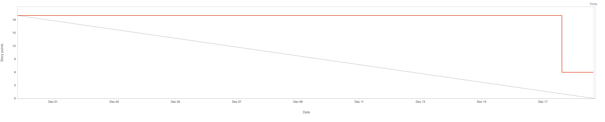

# 2.7.3 Sprint Review

## Review Sprint Ziele

| **Sprint Ziel**         | **Status** |
| ----------------------- | ---------- |
| Design Business Prozess | 100%       |
| Web-UI                  | 100%       |
| Integrate in Camunda    | 80%        |

## Status Project Board

| **Total Tickets** | **Abgeschlossene Tickets** | **Nicht abgeschlossene Tickets** | **Prozentsatz** |
| :---------------: | -------------------------- | -------------------------------- | --------------- |
|        13         | 11                         | 2                                | 85%             |

| **Total Storypoints** | **Abgeschlossene Storypoints** | **Nicht abgeschlossene Storypoints** | **Prozentsatz** |
| :-------------------: | ------------------------------ | ------------------------------------ | --------------- |
|          19           | 16                             | 3                                    | 85%             |

## Anpassungen am Projekt?

Es werden keine Anpassungen am Projekt vorgenommen.

## Notizen / Anmerkungen

Die Semesterarbeit befindet sich in einem sehr guten Zwischenstand und folgt dem vorgegebenen Zeitplan. Während des zweiten Sprints konnten beträchtliche Fortschritte erzielt werden. Obwohl bereits in der Planungsphase des Sprints absehbar war, dass nur begrenzt Zeit für die Arbeit an der Semesterarbeit zur Verfügung stehen würde, wurde die verfügbare zeit effektiv genutzt. Diese zeitliche Einschränkung resultierte hauptsächlich aus beruflichen Verpflichtungen und persönlichen Umständen. Trotzdem gelang es, durch intensives Arbeiten am vergangenen Wochenende zahlreiche Aufgaben zu bewältigen und umzusetzen.

In diesem Sprint habe ich bedeutende Fortschritte erzielt. Ich habe den Geschäftsprozess erfolgreich visualisiert und einen grossen Teil davon in Camunda integriert. Die Integration von Benachrichtigungssystemen und des Genehmigungsprozesses habe ich bereits erfolgreich abgeschlossen. Die vollständige Anbindung an AWS steht allerdings noch aus. Zusätzlich habe ich ein Webportal entwickelt, das über das Internet zugänglich ist und den Start eines Bestellvorgangs ermöglicht. Ein wesentlicher Zeitfaktor war der Austausch und die Dokumentation des Meetings zum Thema SQS-Datenaustausch.

---

- [GIT Repository Tag - Sprint02](https://github.com/Cloud-native-engineering/sem02_bpm/releases/tag/sprint-02)
- [Jira Board](https://itcne23.atlassian.net/jira/software/projects/BPM/boards/2)
- [Jira Sprint Tickets](https://itcne23.atlassian.net/browse/BPM-54?jql=Sprint%20%3D%203%20order%20by%20created%20DESC)
- [Jira Epics](https://itcne23.atlassian.net/browse/BPM-28?jql=project%20%3D%20BPM%20AND%20issuetype%20%3D%20Epic%20order%20by%20created%20DESC)
- [Jira Backlog](https://itcne23.atlassian.net/jira/software/projects/BPM/boards/2/backlog)