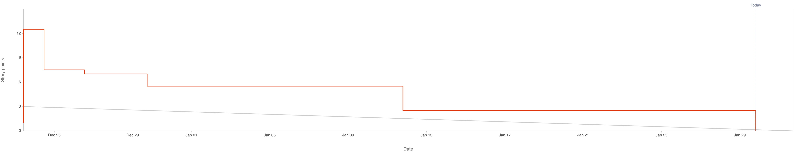

# 2.8.3 Sprint Review

## Review Sprint Ziele

| **Sprint Ziel**          | **Status** |
| ------------------------ | ---------- |
| Sprint 02 leftovers      | 100%         |
| Test SQS Daten Austausch | 100%         |
| Erstellen Präsentation   | 100%         |
| Finish Work              | 100%         |

## Status Project Board

| **Total Tickets** | **Abgeschlossene Tickets** | **Nicht abgeschlossene Tickets** | **Prozentsatz** |
| :---------------: | -------------------------- | -------------------------------- | --------------- |
|        12         | 12                         | 0                               | 100%              |

| **Total Storypoints** | **Abgeschlossene Storypoints** | **Nicht abgeschlossene Storypoints** | **Prozentsatz** |
| :-------------------: | ------------------------------ | ------------------------------------ | --------------- |
|          12.5           | 12.5                             | 0                                    | 100%             |

## Anpassungen am Projekt?

Es werden keine Anpassungen am Projekt vorgenommen, da das Projekt beendet wird.

## Notizen / Anmerkungen

Die Semesterarbeit wurde erfolgreich abgeschlossen. Hinsichtlich des zeitlichen Ablaufs waren in diesem Sprint keine grösseren Anpassungen notwendig. Alle Aufgaben konnten ohne Zeitdruck durchgeführt und abgeschlossen werden.

Eine detaillierte Reflexion über die Semesterarbeit finden Sie [hier](../../05_fazit/index.md).

---

- [GIT Repository Tag - Sprint03](https://github.com/Cloud-native-engineering/sem02_bpm/releases/tag/sprint-03)
- [Jira Board](https://itcne23.atlassian.net/jira/software/projects/BPM/boards/2)
- [Jira Sprint Tickets](https://itcne23.atlassian.net/browse/BPM-56?jql=Sprint%20%3D%204%20order%20by%20created%20DESC)
- [Jira Epics](https://itcne23.atlassian.net/browse/BPM-28?jql=project%20%3D%20BPM%20AND%20issuetype%20%3D%20Epic%20order%20by%20created%20DESC)
- [Jira Backlog](https://itcne23.atlassian.net/jira/software/projects/BPM/boards/2/backlog)
