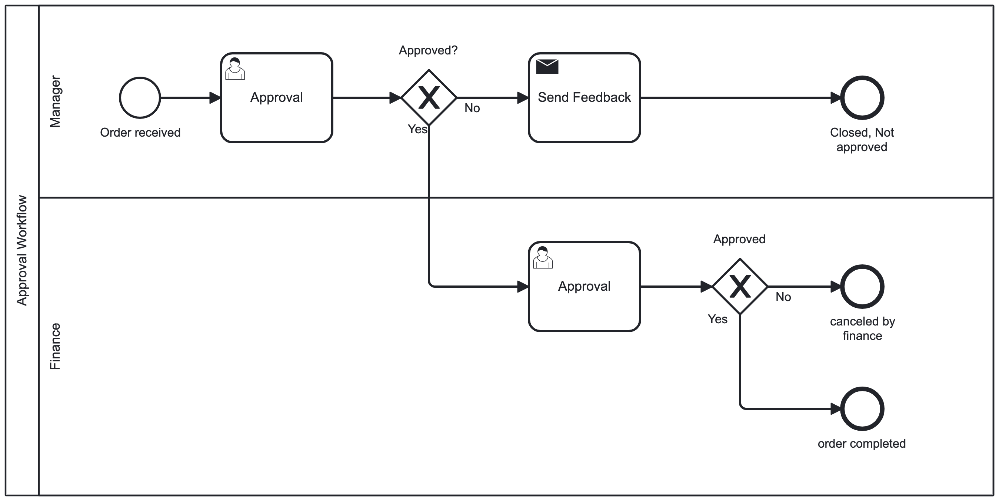

# 3.4 Genehmigungsprozesse Camunda

Ein Genehmigungsprozess erfordert menschliche Intervention, da verschiedene Überprüfungen durchgeführt werden müssen und eine abschliessende Entscheidung von einer menschlichen Instanz getroffen wird. Solche Genehmigungsprozesse sind in verschiedenen geschäftlichen Abläufen anzutreffen, insbesondere in den Bestellprozessen von Unternehmen.

Workflow-Engines wie Camunda unterstützen manuelle Aufgaben, darunter auch Genehmigungsprozesse. In Camunda kann der Genehmigungsprozess mithilfe eines BPMN-Diagramms visualisiert werden. Am Ende eines Usertasks wird ein X-OR-Gateway eingefügt, das die Entscheidung im Diagramm dokumentiert. Dabei muss das Gateway so konfiguriert werden, dass es von einer Maschine verstanden werden kann. Dies erfolgt mithilfe von Variablen in Verbindung mit RegEx oder Booleans.

Als konkretes Beispiel ist nachfolgend ein Genehmigungsprozess visualisiert in der BPMN-Form, welche von Camunda verstanden wird.

