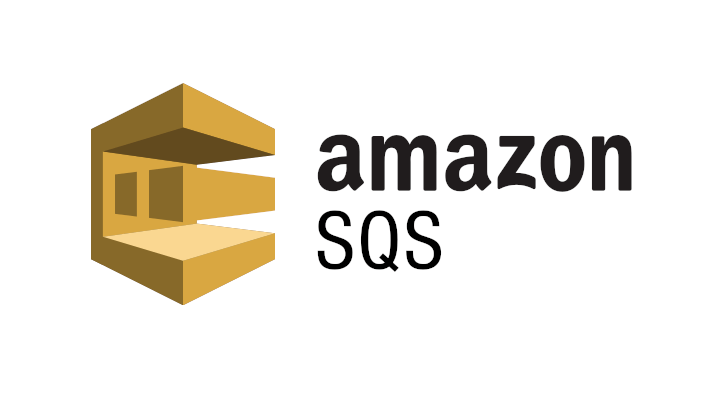

# 3.3 AWS integration

In dieser Arbeit wird die Camunda Platform mit AWS integriert. Dabei wird zu integration eine [AWS - SQS](https://aws.amazon.com/sqs/) verwendet. Amazon Simple Queuing Service ist ein "Software as a Service" Produkt, welches für Messaging-Queues verwendet werden kann. In der Open-Source Welt ist Amazon SQS vergleichbar mit [ActiveMQ](https://activemq.apache.org/) von der Apache Foundation.

Die integraion von Camunda mit der SQS erfolgt über ein Caumunda Modul, oder als Script.

