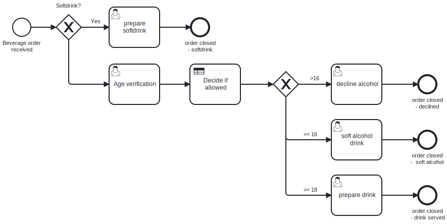
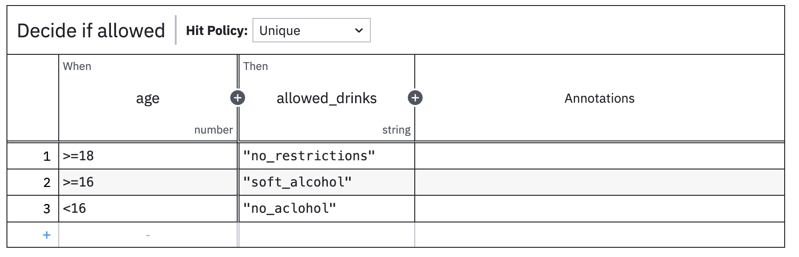

# 3.5 Decision Model and Notation - DMN

Entscheidungsmodelle und Notationsmethoden, wie das Decision Model and Notation (DMN) bieten eine strukturierte Herangehensweise an das Management von Entscheidungen in geschäftlichen Abläufen. DMN ermöglicht es, die Logik und Struktur von Entscheidungen in einer klaren und einheitlichen Form zu dokumentieren. DMN verwendet visuelle Blöcke um eine Entscheidung besser zu verstehen. Dabei werden Entscheidungstabellen und Boxen versendet um die Entscheidung grafisch darzustellen. Diese grafische Darstellung fördert das Verständnis zwischen den involvierten Personen in einem Prozess.

Workflow-Engines, die DMN integriert haben können diese Entscheidungsmodelle Nahtlos in den "Business Process Model and Notation" integrieren. Dabei wird klarheit in einem Prozess geschaffen und ein Entscheid kann automatisiert werden.

Ein konkretes Beispiel könnte eine Altersüberprüfung sein, wie es beim Ausschank von alkoholischen Getränken ist. Folgend ist dieser Prozess visualisiert:

