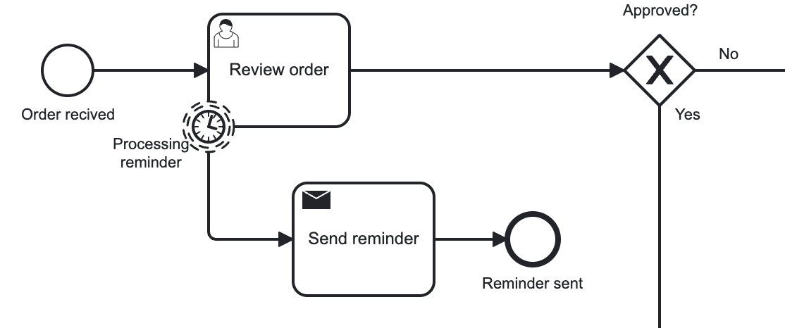

# 3.6 Benachrichtigungen

In Camunda werden Nachrichten und Benachrichtigungen durch spezifische Elemente in Prozessdiagrammen dargestellt, was die Visualisierung und Verständlichkeit für verschiedene Beteiligten verbessert. Ähnlich wie bei BPMN können klare Verbindungen zwischen Nachrichtenprozessen und anderen Geschäftsabläufen hergestellt werden. Dies trägt dazu bei, die Kommunikation und das Informationsmanagement in unternehmerischen Prozessen zu optimieren.

Die Integration von Benachrichtigungen in Camunda erfolgt entweder durch das Verfassen von Skripten oder die Verwendung eines Moduls. Die Wahl der Methode hängt stark davon ab, wer die Benachrichtigungen erhalten soll – ob es sich um eine menschliche Interaktion handelt oder um die Verknüpfung mit anderen technischen Prozessen. Die Lösungsansätze unterscheiden sich wahrscheinlich, je nachdem, ob die Benachrichtigung an eine Einzelperson oder an eine Kette technischer Prozesse gerichtet ist.

Ein konkretes Beispiel verdeutlicht einen Abschnitt einer Benachrichtigung in Camunda: Hierbei wird eine Erinnerung verschickt, um darauf hinzuweisen, dass der User-Task noch nicht verarbeitet wurde.

