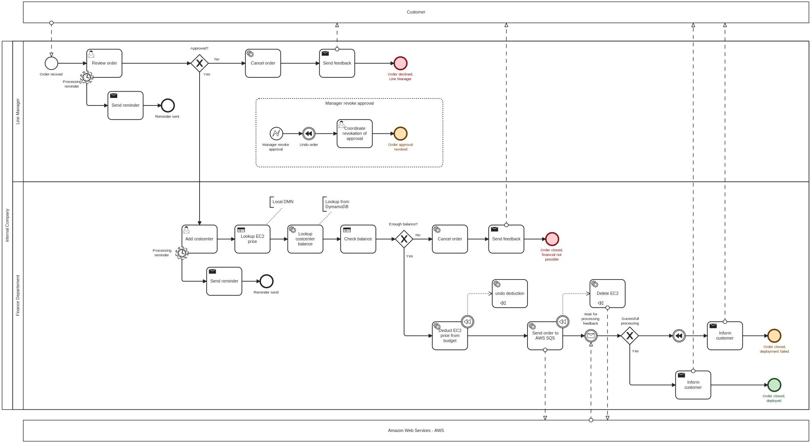

# 4.3 Business Process Model

Hier ist der entwickelte Geschäftsprozess dargestellt. Er umfasst alle Ziele, die in den Anforderungen definiert wurden. Der Prozess beginnt mit dem Eingang einer Kundenbestellung. Diese wird zunächst vom zuständigen Vorgesetzten geprüft und bei Erfüllung der Kriterien freigegeben.

Anschliessend wird die Bestellung an die Finanzabteilung weitergeleitet. Dort erfolgt die Definition und Hinzufügung der Kostenstelle. Nach dieser Nutzeraktion werden automatisierte Skripte und [Decision Model and Notation (DMN)](../03_Camunda/dmn.md) Tasks durchgeführt. Diese vergleichen die Kosten der EC2-Instanz mit dem Budget der zugeordneten Kostenstelle.

Basierend auf diesem Vergleich entscheidet das Camunda-System, ob die Bestellung wirtschaftlich umsetzbar ist. Falls das Budget der Kostenstelle ausreichend ist, werden die Kosten abgebucht. Im letzten Schritt wird die Bestellung im definierten JSON-Austauschformat an die AWS Simple Queue Service (SQS)-Warteschlange gesendet.

Daraufhin verarbeitet Fabio Beti in seiner Arbeit die Daten weiter und sendet eine Rückmeldung. Nach Erhalt dieser Rückmeldung ist die virtuelle Maschine (VM) entweder korrekt eingerichtet, oder es wird ein Fehler im Bereitstellungsprozess gemeldet und der Bestellvorgang ist damit abgeschlossen.

Die BPMN-Datei kann hier heruntergeladen werden: [aws_ec2_order_design.bpmn](../../resources/artifacts/aws_ec2_order_design.bpmn)
