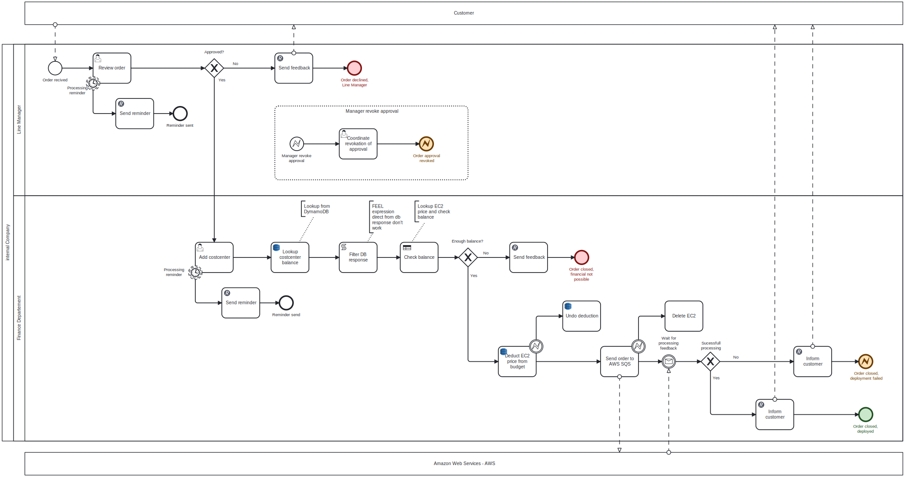
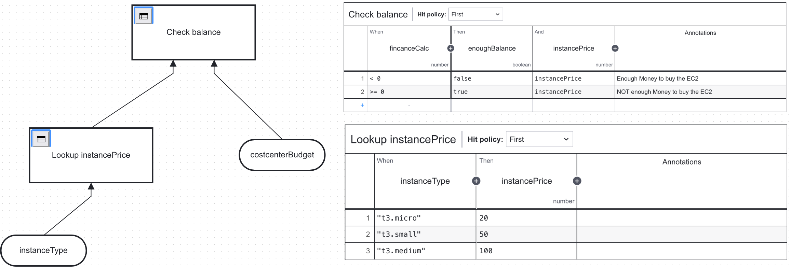

# 4.4 Camunda Integration

Um das Business Process Model and Notation (BPMN) Diagramm erfolgreich in die Camunda Engine zu integrieren, sind mehrere Schritte erforderlich. Ein tiefgehendes Verständnis des zugrundeliegenden Geschäftsprozesses ist dabei essenziell. Das vorliegende BPMN-Diagramm zeigt die Integration in die Camunda Engine. Zur Umsetzung und Integration des Prozesses waren einige Anpassungen nötig. Diese Änderungen am Design werden in diesem Abschnitt untersucht und erläutert.



Die DPMN-Datei kann hier gefunden werden: [aws_ec2_order.bpmn](../../camunda/aws_ec2_order.bpmn)

## 4.4.1 DMN

Ein Computer benötigt für Entscheidungsprozesse eine klare Basis, die durch ein DMN (Decision Model and Notation)-Diagramm dargestellt werden kann. Im Vergleich mit dem initial Design wurden die DMN-Entscheidungen separat gezeichnet. Diese beiden DMN-Task wurden bei der Integration zusammengeführt, um den Prozess übersichtlicher und die Entscheidungsfindung transparenter zu gestalten.

Im ersten Schritt des Entscheidungsprozesses wird der Preis einer EC2-Instanz ermittelt. Der dabei verwendete Schlüsselstring, der bei der Bestellung übermittelt wird, wird mithilfe einer Tabelle in den entsprechenden Preis konvertiert.

Der zweite Schritt prüft, ob die verantwortliche Kostenstelle über ausreichend Budget verfügt, um eine Bestellung auszulösen. Diese Prüfung erfolgt in Verbindung mit einer [FEEL-Berechnung (Friendly Enough Expression Language)](https://docs.camunda.io/docs/components/modeler/feel/what-is-feel), bei der der Preis der Instanz vom Budget der Kostenstelle abgezogen wird. Sollte das Ergebnis dieser Berechnung grösser oder gleich Null sein, verfügt die Kostenstelle über genügend Mittel, um die Bestellung zu tätigen. Sollte das Ergebnis dieser Berechnung kleiner als Null sein, bedeutet dies, dass die Kostenstelle nicht über ausreichende Mittel verfügt und somit die Bestellung nicht ausführen kann. Dies stellt sicher, dass nur Bestellungen innerhalb des verfügbaren Budgetrahmens getätigt werden, um die finanzielle Integrität der Kostenstelle zu wahren.



Die DMN-Datei kann hier gefunden werden: [dmn_finance_ckeck.dmn](../../camunda/sem02_dmn_finance_check.dmn)

## 4.4.2 Integrationen

Die Zeichnung des Geschäftsprozesses ist zwar schön und gut, um jedoch das volle Potenzial und den maximalen Mehrwert des Prozesses auszuschöpfen, wird er mit einer Vielzahl von Tools und Technologien integriert und vernetzt. Folgend sind verschiedene Tools beschreiben, welchen den Geschäftsprozess ergänzen.

### 4.4.2.1 Mailgun

Damit stets die richtigen Personen informiert werden, wurde der Geschäftsprozess mit einem Email-Gateway ergänzt. Dieser ermöglicht die Stakeholder welche im Prozess gefragt sind zu informieren. Dazu wurde [Mailgun](https://www.mailgun.com/) als Email-Gateway verwendet. Der Hauptgrund, warum genau dieser Mail-Gateway verwendet wird, ist, dass dieser über ein grosszügiges Angebot zusammen mit dem [GitHub Students Developer Pack](https://education.github.com/pack) anbietet. Integriert wurde diese Lösung mit dem RestAPI. Folgend ein Beispiel Request, welcher Camunda Absetzt.

```bash
curl -s --user 'api:<API-KEY>' \
    https://api.mailgun.net/v3/XXX/messages \
    -F from='EC2-Order Service mailgun@XXX.mailgun.org' \
    -F to=<ADDRESS> \
    -F subject='A Task is waiting for approval' \
    -F text='Open task waiting for approval. Please review the Order at https://xxx...'
```

Diese Ingegration wurde mit Hilfe folgendem Connector gemacht: [HTTP REST Connector](https://github.com/camunda/connectors/tree/main/connectors/http/rest)

### 4.4.2.2 DynamoDB

Das Budget einer bestimmten Kostenstelle wird in einer NoSQL-Datenbank gespeichert. Für diese Anwendung wurde DynamoDB als NoSQL-Lösung gewählt, da es die Möglichkeit bietet, serverlos in der AWS Cloud betrieben zu werden. Während des Integrationsprozesses erfolgen sowohl Lese- als auch Schreibzugriffe auf diese Datenbank. Die Struktur der Datenbank umfasst eine Tabelle, deren Aufbau sich wie folgt darstellt:

| costcenter_name | budget | old_budget |
| :-------------- | :----- | :--------- |
| "it_main"       | 500    |            |
| "it_security"   | 200    | 250        |
| "XYZ"           | 1234   | 12345      |

Diese Integration wurde mit Hilfe folgendem Connector gemacht: [AWS-DynamoDB Connector](https://github.com/camunda/connectors/tree/main/connectors/aws/aws-dynamodb)

### 4.4.2.3 Simple Queuing Service - SQS

Der Datenaustausch mit AWS wird durch den Einsatz einer SQS-Queue realisiert. Dabei werden die Daten im JSON-Format in die Queue eingefügt. Anschliessend erfolgt die weitere Verarbeitung dieser Daten durch die Arbeit von Fabio Beti.

Die Struktur des JSON ist folgend genauer beschrieben: [Dokumentation Data Exchange](./02_data_exchange.md)

Diese Ingetration wurde mit Hilfe folgendem Connector gemacht: [AWS-SQS Connector](https://github.com/camunda/connectors/tree/main/connectors/aws/aws-sqs)

### 4.4.2.4 Python

Um zu gewährleisten, dass der Prozess nach der Übertragung der Daten in die SQS-Queue einen Status über den Erfolg der Bereitstellung erhält, wurde ein Python-Skript entwickelt. Dieses Skript sendet eine Nachricht an die [Zeebe-Engine](https://camunda.com/de/platform/zeebe/) (ein Backend der Camunda-Plattform), um den Prozessstatus zu aktualisieren. In der BPMN-Modellierung wird dazu ein "Intermediate Message Catch" verwendet. Dieser sorgt dafür, dass die Prozessinstanz auf eine veröffentlichte Nachricht im Zeebe-Backend wartet. Zur gezielten Steuerung der richtigen Prozessinstanz wird die OrderID als Mapping-Referenz eingesetzt. Zusätzlich wird eine boolsche Variable übermittelt, die Auskunft darüber gibt, ob das Deployment erfolgreich war.

Das Python-Script wurde hier abgelegt: [Send Message to Zeebe](../../resources/artifacts/intermediateMessageCatchEvent.py)

### 4.4.2.5 Webhosting

Um eine Online-Bestellung zu ermöglichen, ist eine entsprechende Website notwendig, welche jederzeit online und zugänglich ist. Diese Verfügbarkeit wurde durch die Integration der Camunda Cloud realisiert, welche ein öffentlich zugängliches Formular bereitstellt. Die Implementierung der Camunda Cloud gewährleistet dabei nicht nur eine Online-Präsenz, sondern bietet auch eine benutzerfreundliche Schnittstelle, die den Bestellvorgang vereinfacht und optimiert.

Folgend ist beschrieben wie dies umgesetzt werden kann: [Camunda Public Form](https://docs.camunda.io/docs/components/modeler/web-modeler/advanced-modeling/publish-public-processes/)

### 4.4.2.6 Camunda Forms

Um die Benutzerinteraktion zu optimieren, kamen unterschiedliche [Camunda-Formulare](https://docs.camunda.io/docs/components/modeler/forms/camunda-forms-reference/) zum Einsatz. Diese gewährleisten eine reibungslose Integration und effektive Validierung der Daten. In dieser Arbeit wurden speziell für folgende User-Aufgaben Formulare implementiert:

- [Erstellung einer Bestellung](../../camunda/sem02_bpm_create_order.form)
- Genehmigungsprozess
  - [Line Manager](../../camunda/sem02_bpm_approve_order.form)
  - [Finanz Abteilung](../../camunda/sem02_bpm_add_costcenter.form)

## 4.4.3 Credentials Handling

Die Credentials und Secret welche für die Integrationen verwendet werden befinden sich nicht direkt im BPMN-File, sondern [Camunda Cluster Secrets](https://docs.camunda.io/docs/components/console/manage-clusters/manage-secrets/). Es wurden folgende Secrets erstellt:

| Secret-Name        | Beschreibung            |
| :----------------- | :---------------------- |
| sem02_notification | API-Key für Mailgun     |
| sem02_db_user      | Access key für DynamoDB |
| sem02_db_password  | Secret key für DynamoDB |
| sem02_sqs_user     | Access key für SQS      |
| sem02_sqs_password | Secret key für SQS      |

## 4.4.4 Abweichungen vom Design

Bei jeder Umsetzung treten unvermeidlich Abweichungen vom ursprünglichen Design auf. Dies trifft auch auf diese Semesterarbeit zu, bei der sich Unterschiede zwischen dem BPMN-Entwurf und dem integrierten Prozess ergaben. Die folgenden Abweichungen wurden in dieser Arbeit festgestellt:

1. **Compensate Events**
   <br>Die Camunda Platform in der Version 8 unterstützt keine [Compensate Events](https://camunda.com/blog/2015/08/brining-together-transactions-cancel/) (Stand 25.12.2023). Damit die Funktionalität eines wiederufen des Approval des Vorgesetzten trotzdem umgesetzt werden kann wurden [Error Events](https://docs.camunda.io/docs/components/modeler/bpmn/error-events/) eingesetzt. Obwohl diese Lösung nicht vollständig mit einem Compensate Event vergleichbar ist, stellt sie im Rahmen dieser Arbeit einen akzeptablen Workaround dar. Camunda wird voraussichtlich mit der Version 8.5 Compensate Events unterstützen. Der Status kann aus folgendem GitHub Epic nachgeschaut werden: [Add support for BPMN compensation events](https://github.com/camunda/zeebe/issues/14920)
2. **DMN**
   <br>Im Vergleich mit dem initial Design wurden die DMN-Entscheidungen separat gezeichnet. Diese beiden DMN-Task wurden bei der Umsetzung zusammengeführt, um den Prozess übersichtlicher und die Entscheidungsfindung transparenter zu gestalten.
3. **Filter Event**
   <br>Beim Einrichten der Datenbankverbindung trat ein Problem bei der Abfrage des Budgets auf. Es war nicht möglich, das JSON direkt aus der Rückmeldung zu verarbeiten. Um dieses Problem zu lösen, wurde ein zusätzlicher Task implementiert, der mithilfe einer FEEL-Expression das Budget extrahiert.
